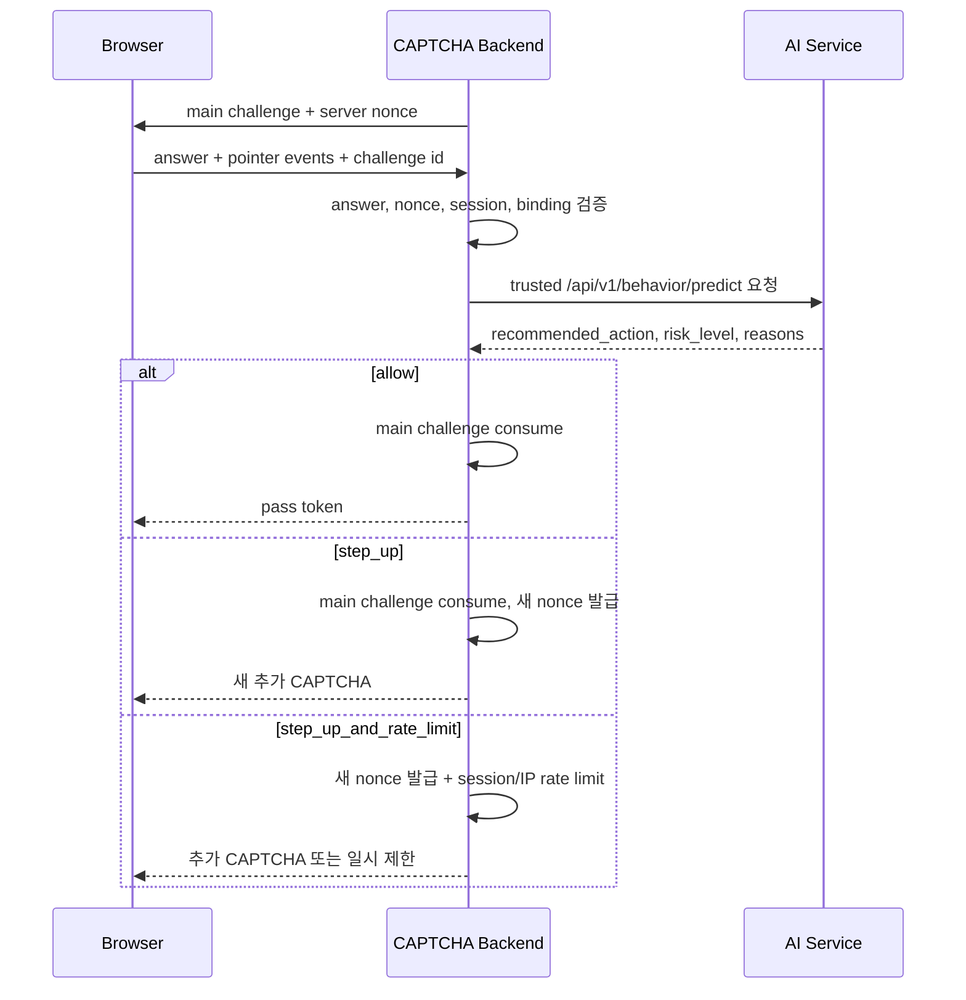

# CAPTCHA-AI 위험 판단 연결 계약

기준일: 2026-07-22

이 문서는 CAPTCHA 구현이 완료된 뒤 백엔드와 AI service를 연결하는 규칙이다. 현재는 명세만 확정하며, 브라우저 또는 CAPTCHA 화면이 AI service를 직접 호출하지 않는다.

## 책임 분리

| 구성요소 | 책임 |
|---|---|
| Frontend | pointer event 수집, CAPTCHA 답안 제출, 서버가 내린 화면 전환 표시 |
| CAPTCHA backend | challenge 발급·정답 검증·nonce/세션 바인딩·일회성 소비·최종 통과/실패 결정 |
| AI service | 궤적 feature 추출, Human score와 위험 단계 산출, `allow` 또는 `step_up` 권고 |

AI 결과는 **권고(advisory)** 이며, 통과 토큰 발급이나 최종 차단 권한은 CAPTCHA backend만 가진다.

## 처리 흐름

## AI 응답 처리 규칙

| AI `recommended_action` | Backend 처리 | 사용자에게 보이는 결과 |
|---|---|---|
| `allow` | 답안이 정답일 때만 기존 challenge를 소비하고 pass token 발급 | 통과 |
| `step_up` | 기존 challenge를 소비한 뒤, **새 challenge id와 nonce**로 추가 문제 발급 | 추가 CAPTCHA |
| `step_up_and_rate_limit` | 새 challenge 발급, 세션·요청 빈도 제한 기록 | 추가 CAPTCHA 또는 잠시 대기 |

`allow`는 문제 정답 검증을 건너뛰는 의미가 아니다. 답안 오류, nonce 오류, 세션 바인딩 오류, 이미 소비된 challenge는 AI 점수와 무관하게 실패 처리한다.

## Backend -> AI 요청 조건

1. Backend만 `X-Captcha-Backend-Key`로 AI `/api/v1/behavior/predict`를 호출한다.
2. `challenge_id`, `session_id`, CAPTCHA 크기, pointer events는 backend가 발급하거나 검증한 값으로 구성한다.
3. frontend가 보낸 임의 `session_id`를 신뢰하지 않고, 로그인/비로그인 서버 세션에서 재확인한다.
4. 동일 challenge의 재제출은 backend에서 먼저 막고, AI 응답으로 통과 여부를 뒤집지 않는다.

## 저장 및 shadow mode

초기에는 실제 통과 로직을 바꾸지 않고 다음을 함께 저장한다.

- AI model version, threshold, `risk_level`, `recommended_action`, `reasons`
- Human score와 risk score
- main CAPTCHA 정답 여부, step-up 발급 여부, step-up 정답 여부
- 세션별 시도 횟수와 최종 서버 verdict

Backend는 `/predict` 결과의 `policy_mode`가 `shadow`이면 `recommended_action`을 적용하지
않고 일반 CAPTCHA verdict를 그대로 처리한다. 처리 후 같은 `attempt_id`로
`POST /api/v1/behavior/shadow/outcomes`를 한 번 호출한다. AI service는 저장된 prediction에서
`would_have_action`을 직접 복사하므로, backend가 임의의 AI 행동을 기록할 수 없다.

관리자는 `GET /api/v1/admin/shadow/summary`로 action별 main CAPTCHA 통과·실패 분포와
would-step-up 비율만 확인한다.

개인식별정보, 정답 원문, 불필요한 브라우저 식별값은 저장하지 않는다. Shadow mode에서 정상 사용자의 step-up 비율과 추가 CAPTCHA 실패율을 확인한 뒤에만 실제 정책 적용을 검토한다.

## 완료 조건

1. `allow`, `step_up`, `step_up_and_rate_limit` 세 흐름의 backend integration test가 통과한다.
2. nonce·세션·문제 바인딩 불일치 및 재사용 요청이 모두 거부된다.
3. `step_up`은 기존 challenge를 재사용하지 않고 새 문제를 발급한다.
4. shadow mode 기록에서 사용성 지표와 실제 CAPTCHA 성공률을 검토한다.
